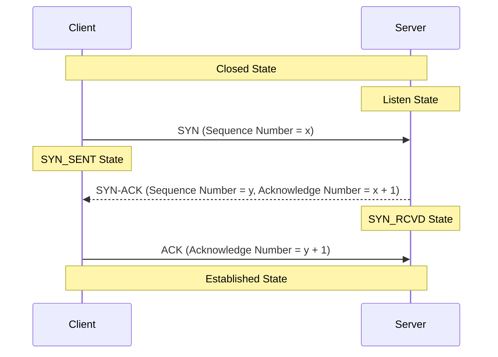

##### For windows, install openssl from [this website](https://slproweb.com/products/Win32OpenSSL.html). After installation add C:\apps26\openssl\bin(your installable folder location to your path).
```sh
# generate a private key of 4096 bit length, store this in base64 encoded .pem format and keep it encrypted using aes-256, as there is no point of keeping a private key in plain text, pass phrase(rsa.aes256.private.key.pem) will be the file name for this proof of concept work.
openssl genrsa -aes256 -out rsa.aes256.private.key.pem 4096
# private key also keeps track of public key because both of these keys are huge prime no generated in pairs.
openssl rsa -in .\rsa.aes256.private.key.pem -pubout -out .\rsa.aes256.public.key.pem 
# to capture certificate information in command line and then save Server certificate section manually
openssl s_client -connect www.instagram.com:443 # saved in instagram.certificate.pem
openssl s_client -connect www.google.com:443 # saved in google.certificate.pem
openssl s_client -connect www.comodo.com:443 # saved in comodo.certificate.pem
```
##### Open keychain in Mac or certmgr.msc in windows(under Trusted Root Certification Authorities > Certificates). Certificate signing request must be sent to server where certificate will be signed. As private key is private, that is why we need to send a CSR to CA server.
##### Asymmetric Encryption is not used between web browser and web server, in that case both party must have others public key and their own private key for communication. TLS session(**Negotiate Cipher Suites -> Server Certificate Received -> Verify Server Certificate -> Generate Symmetric Key Based On Cipher Suites Negotiated Before-> Send/Receive Encrypted Data Based On Cipher Suites Negotiated Before**).
##### TCP Session(Threeway Handshake)-Initial Sequence Number(Synchronize / Synchronize Acknowledgement / Acknowledgement), 

##### Add Delta Time Displayed in Wireshark -> Edit -> Preferences -> Column. Check The status bar in wireshark, it will show you the filter criteria expression when you select properties in a packet(if Flags are selected in a packet, corresponding tcp.flags expression is shown in status bar).