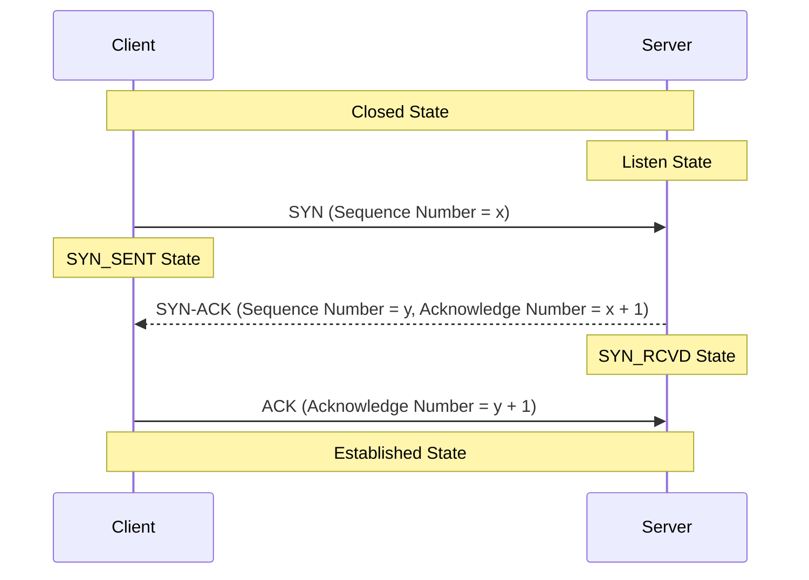

##### For windows, install openssl from [this website](https://slproweb.com/products/Win32OpenSSL.html). After installation add C:\apps26\openssl\bin(your installable folder location to your path).
```sh
# generate a private key of 4096 bit length, store this in base64 encoded .pem format and keep it encrypted using aes-256, as there is no point of keeping a private key in plain text, pass phrase(rsa.aes256.private.key.pem) will be the file name for this proof of concept work.
openssl genrsa -aes256 -out rsa.aes256.private.key.pem 4096
# private key also keeps track of public key because both of these keys are huge prime no generated in pairs.
openssl rsa -in .\rsa.aes256.private.key.pem -pubout -out .\rsa.aes256.public.key.pem 
# to capture certificate information in command line and then save Server certificate section manually
openssl s_client -connect www.instagram.com:443 # saved in instagram.certificate.pem
openssl s_client -connect www.google.com:443 # saved in google.certificate.pem
openssl s_client -connect www.comodo.com:443 # saved in comodo.certificate.pem
```
##### Open keychain in Mac or certmgr.msc in windows(under Trusted Root Certification Authorities > Certificates). Certificate signing request must be sent to server where certificate will be signed. As private key is private, that is why we need to send a CSR to CA server.
##### Asymmetric Encryption is not used between web browser and web server, in that case both party must have others public key and their own private key for communication. TLS session(**Negotiate Cipher Suites -> Server Certificate Received -> Verify Server Certificate -> Generate Symmetric Key Based On Cipher Suites Negotiated Before-> Send/Receive Encrypted Data Based On Cipher Suites Negotiated Before**).
##### TCP Session(Threeway Handshake)-Initial Sequence Number(Synchronize / Synchronize Acknowledgement / Acknowledgement), 

##### Add Delta Time Displayed in Wireshark -> Edit -> Preferences -> Column. Check The status bar in wireshark, it will show you the filter criteria expression when you select properties in a packet(if Flags are selected in a packet, corresponding tcp.flags expression is shown in status bar).
##### [Create Github Pages for your portfolio](https://github.com/SageGandhi/sagegandhi.github.io)
##### [Free Infinity Hosting Website](https://dash.infinityfree.com/accounts)
##### Automatic Certificate Management Environment(automating interactions between certificate authorities and their users' servers, allowing the automated deployment)

##### Confidentiality(Encryption), Integrity(Hashing), Authentication(PKI), Anti-Replay(Sequence#), Non-Repudiation(No Way To Deny)-By Product Of Integrity & Authentication.
```sh
echo -ne "learning on how hashing generate fixed width output with diffusion" | sha1sum # generating hash
# creating rsa private key, encrypted with passphrase by aes256, and read it using openssl
openssl genrsa -aes256 -out rsa.4096.key.pem 4096 && openssl rsa -in rsa.4096.key.pem -noout -text

# encrypt the rsa private key and then keep it in decrypted plain base64 format,and encrypt again with different phrase
openssl genrsa -aes256 -out rsa.4096.key.pem 4096 && openssl rsa -in rsa.4096.key.pem -out rsa.4096.key.decrypted.pem
openssl rsa -in rsa.4096.key.decrypted.pem -aes256 -out rsa.4096.key.encrypted.pem  

# creating dsaparam file separately and using it to create dsa key and viewing it
openssl dsaparam -out dsa.4096.param.pem 4096 && openssl dsaparam -in dsa.4096.param.pem -text -noout
openssl gendsa -out dsa.4096.key.pem dsa.4096.param.pem && openssl dsa -in dsa.4096.key.pem -text -noout

# creating dsaparam and dsa key in a single file and viewing it
openssl dsaparam -genkey -out dsa.4096.single.key.pem 4096 
openssl dsa -in dsa.4096.single.key.pem -text -noout && openssl dsaparam -in dsa.4096.single.key.pem -text -noout

# creating eclliptic curve parameter and saving it into ec.param.pem
openssl genpkey -genparam -algorithm ec -pkeyopt ec_paramgen_curve:secp521r1 -out ec.param.pem 

# checking all curves supported by openssl and viewing ec.param.pem
openssl ecparam -list_curves && openssl ecparam -in ec.param.pem -noout -text

# creating eclliptic curve key using parameter file and viewing
openssl genpkey -paramfile ec.param.pem -out ec.key.pem && openssl ec -in ec.key.pem -noout -text

# generating private key without eclliptic curve parameter
openssl genpkey -algorithm ec -pkeyopt ec_paramgen_curve:P-521 -out ec.without.param.key.pem
openssl ec -in ec.without.param.key.pem  -noout -text

# pkey utility to view rsa,dsa and eclliptic curve keys
openssl genpkey -algorithm ec -pkeyopt ec_paramgen_curve:secp521r1 -out ec.key.pem
openssl dsaparam -genkey -out dsa.4096.key.pem 4096
openssl genrsa -out rsa.4096.key.pem 4096
# review each key using pkey utility
openssl pkey -in ec.key.pem -noout -text 
openssl pkey -in dsa.4096.key.pem -noout -text 
openssl pkey -in rsa.4096.key.pem -noout -text
# review public key 
openssl pkey -in rsa.4096.key.pem -noout -text_pub
openssl pkey -in dsa.4096.key.pem -noout -text_pub
openssl pkey -in ec.key.pem -noout -text_pub
# extract public key
openssl pkey -in ec.key.pem -pubout
openssl pkey -in dsa.4096.key.pem -pubout
openssl pkey -in rsa.4096.key.pem -pubout
```
##### encryption/decryption and signature using openssl
```sh
# creating the private alice.private.key.pem and public alice.public.key.pem key for alice
openssl genpkey -algorithm rsa -pkeyopt rsa_keygen_bits:4096 -out alice.private.key.pem
openssl pkey -in alice.private.key.pem -out alice.public.key.pem -pubout
# creating the private bob.private.key.pem and public bob.public.key.pem key for bob
openssl genpkey -algorithm rsa -pkeyopt rsa_keygen_bits:4096 -out bob.private.key.pem
openssl pkey -in bob.private.key.pem -out bob.public.key.pem -pubout
# create a digest or hash of message for Message Authentication Code
echo "this message is super secret and must be delivered to bob and bob only.">.\secret-message.txt
openssl dgst -sha256 secret-message.txt
# encrypt the sha256 digest using alice.private.key.pem to generate signature, signed by alice
openssl dgst -sha256 -sign alice.private.key.pem -out alice.signed.bin secret-message.txt
# encrypt the message using receiver(bob) public key cipher.using.bob.public.key.bin
openssl pkeyutl -encrypt -in secret-message.txt -pubin -inkey bob.public.key.pem -out cipher.using.bob.public.key.bin 
# message decrypted by bob.private.key.pem, hash(sha256sum) same secret-message.txt and secret-message.txt 1a22685535a19c45493f52eb97737d05551b965524f4825a181674861fc5555a
openssl pkeyutl -decrypt -in cipher.using.bob.public.key.bin -inkey bob.private.key.pem -out decrypted.by.bob
# verify alice generated the signature using alice.public.key.pem(authentication), and text is not modified since alice signed it using alice.private.key.pem(integrity)
openssl dgst -sha256 -verify alice.public.key.pem -signature alice.signed.bin decrypted.by.bob 
```